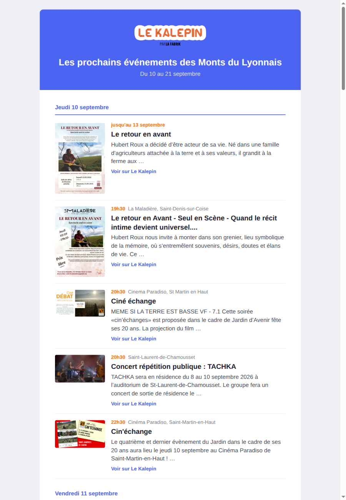

# Newsletter Kalepin

Python script that turns the upcoming events of a [Mobilizon](https://joinmobilizon.org/) instance into an HTML newsletter and sends it with [Brevo](https://www.brevo.com/).

## Screenshot



## About

Built for [Le Kalepin](https://lekalepin.fr), the Mobilizon instance of [La Fabrik](https://lafabrik-moly.fr/) (cultural agenda of the Monts du Lyonnais, France). Every Kalepin-specific value is a default you can override from the environment, so the same image works for any other Mobilizon instance. Dates are written in French; see [Adapting](#adapting-for-other-mobilizon-instances) for other languages.

## How it works

1. Queries the Mobilizon GraphQL API for events starting in the next `NEWSLETTER_DAYS` days
2. Cleans and truncates descriptions, formats dates in the configured timezone, groups events by day
3. Renders `newsletter_template.html` (Jinja2) to `newsletter_events.html`
4. Creates a Brevo campaign from that HTML and sends it to the list (or a test address with `--test`)

## Installation

### Local

```bash
pip install -r requirements.txt
```

### Docker

```bash
docker build -t newsletter-kalepin .
docker run --env-file .env newsletter-kalepin
```

### Pre-built image

```bash
docker pull ghcr.io/cleming/newsletter-kalepin:main
docker run --env-file .env ghcr.io/cleming/newsletter-kalepin:main
```

## Configuration

Copy `.env.example` to `.env`. Required:

| Variable | Description |
|---|---|
| `BREVO_API_KEY` | Brevo API key |
| `BREVO_SENDER_EMAIL` | Sender address (must be validated in Brevo) |
| `BREVO_LIST_ID` | Brevo contact list to send to |
| `BREVO_TEST_EMAIL` | Recipient of `--test` runs (required only for `--test`). Must be an existing Brevo contact |

Optional, defaults are Le Kalepin:

| Variable | Default | Used for |
|---|---|---|
| `MOBILIZON_URL` | `https://lekalepin.fr` | API endpoint (`<url>/api`) and footer link |
| `NEWSLETTER_DAYS` | `12` | Time window, in days from now |
| `NEWSLETTER_TIMEZONE` | `Europe/Paris` | Timezone of displayed dates |
| `NEWSLETTER_SUBJECT` | `Kalepin : les prochains événements` | Email subject and campaign name |
| `NEWSLETTER_TAG` | `Newsletter Kalepin` | Brevo campaign tag (`[TEST]` appended in test mode) |
| `NEWSLETTER_TEMPLATE` | `newsletter_template.html` | Template file, relative to the script |
| `BRAND_NAME` | `Le Kalepin` | Sender name, button label, footer |
| `BRAND_LOGO_URL` | Kalepin logo | Header image (230px wide) |
| `BRAND_TITLE` | `Les prochains événements des Monts du Lyonnais` | Header title |
| `BRAND_COLOR` | `#4B64F2` | Header, buttons, links |
| `BRAND_ACCENT_COLOR` | `#ff7105` | Date badge |

## Usage

```bash
python script.py          # send the campaign to BREVO_LIST_ID
python script.py --test   # create the campaign and send it only to BREVO_TEST_EMAIL
```

Both modes write `newsletter_events.html` next to the script, which you can open in a browser.

## Template

`newsletter_template.html` receives:

- `days`: events grouped by local day, in order: `[{"label": "Jeudi 10 septembre", "events": [...]}, ...]`
- each event has `title`, `description` (text, 150 chars max, cut on a word), `begins` (aware datetime), `day_label`, `time` (`"19h30"`, empty for events starting at midnight), `until` (`"jusqu'au 13 septembre"` for events longer than 24 h, else empty), `picture_url`, `location`, `link`
- `period`: `"Du 10 au 21 septembre"`, the range covered by the events
- `brand`: `name`, `url`, `logo_url`, `title`, `color`, `accent_color` (from the `BRAND_*` variables)

Email clients are picky: keep styles inline, use only media queries in `<style>`, and give images an HTML `width` attribute (several clients ignore CSS `max-width`).

## Adapting for other Mobilizon instances

Set the `MOBILIZON_URL`, `NEWSLETTER_*` and `BRAND_*` variables. To change the layout, point `NEWSLETTER_TEMPLATE` to your own template (mount it into the container). For another language, translate the template texts and the `JOURS` / `MOIS` lists in `script.py`.

## Development

```bash
pip install -r requirements-dev.txt
python test_script.py   # or: pytest
black script.py test_script.py && isort script.py test_script.py && flake8
```

## CI/CD

A GitHub Action builds the Docker image on push to `main` and pushes it to GitHub Container Registry (ghcr.io).
